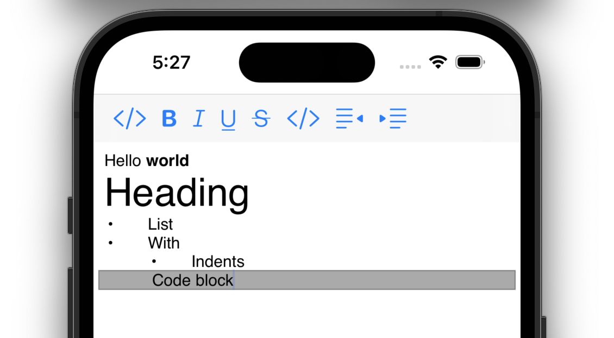

# Lexical iOS

An extensible text editor/renderer written in Swift, built on top of TextKit, and sharing a philosophy and API with [Lexical JavaScript](https://lexical.dev).

## Status

Lexical iOS is used in multiple apps at Meta, including rendering feed posts that contain inline images in Workplace iOS.

As of March 2023, the date of our initial open source release, Lexical iOS should be treated as an unsupported preview version. We have not established a version numbering or release cadence yet; it is expected our first 'release' will be numbered 0.1.

## Playground

We have a sample playground app demonstrating some of Lexical's features:

The playground app contains the code for a rich text toolbar. While this is not specifically a reusable toolbar that you can drop straight into your projects, its code should provide a good starting point for you to customise.

This playground app is very new, and many more features will come in time!

## Requirements
Lexical iOS is written in Swift, and targets iOS 13 and above.

## Building Lexical
We provide a Swift package file that is sufficient to build Lexical core. Add this as a dependency of your app to use Lexical.

The plugins included in this repository do not yet have package files. (This is because we use a different build system internally at Meta. Adding these would be an easy PR if you want to start contributing to Lexical!)

## Using Lexical in your app
For editable text with Lexical, instantiate a `LexicalView`. To configure it with plugins and a theme, you can create an `EditorConfig` to pass in to the `LexicalView`'s initialiser.

To programatically work with the data within your `LexicalView`, you need access to the `Editor`. You can then call `editor.update {}`, and inside that closure you can use the Lexical API.

For more information, see the documentation.

## Full documentation
Read [the Lexical iOS documentation](https://facebook.github.io/lexical-ios/documentation/lexical/). 

## Join the Lexical community
Feel free to join us at [our Discord server](https://discord.gg/KmG4wQnnD9), where you can talk with the Lexical team and other users.

See the [CONTRIBUTING](CONTRIBUTING.md) file for how to help out.

## Tests
Lexical has a suite of unit tests, in XCTest format, which can be run from within Xcode. We do not currently have any end-to-end tests.

## License
Lexical is [MIT licensed](https://github.com/facebook/lexical/blob/main/LICENSE).
